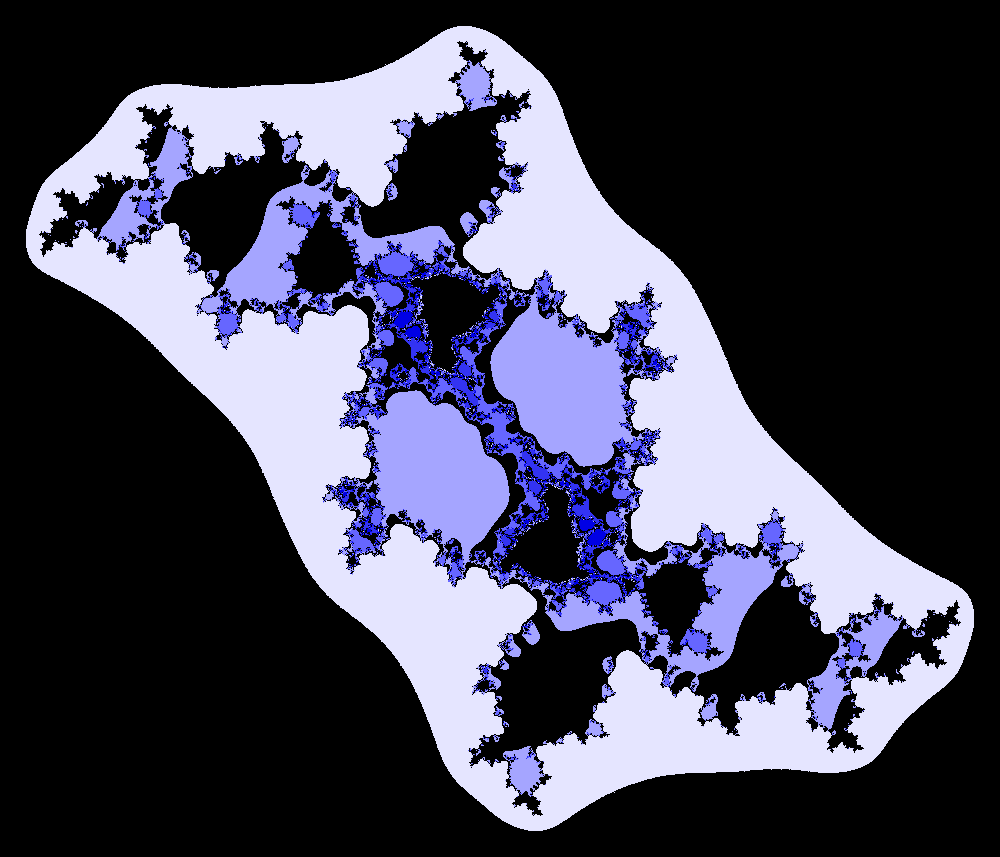
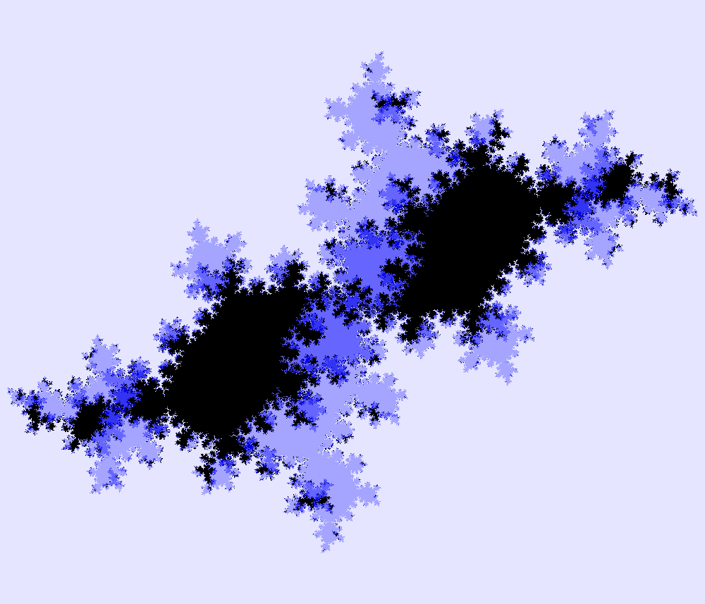
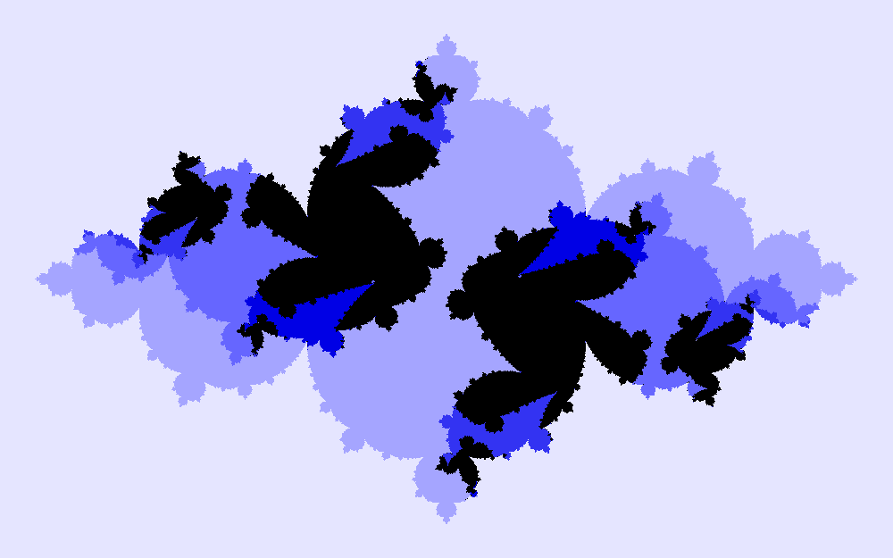
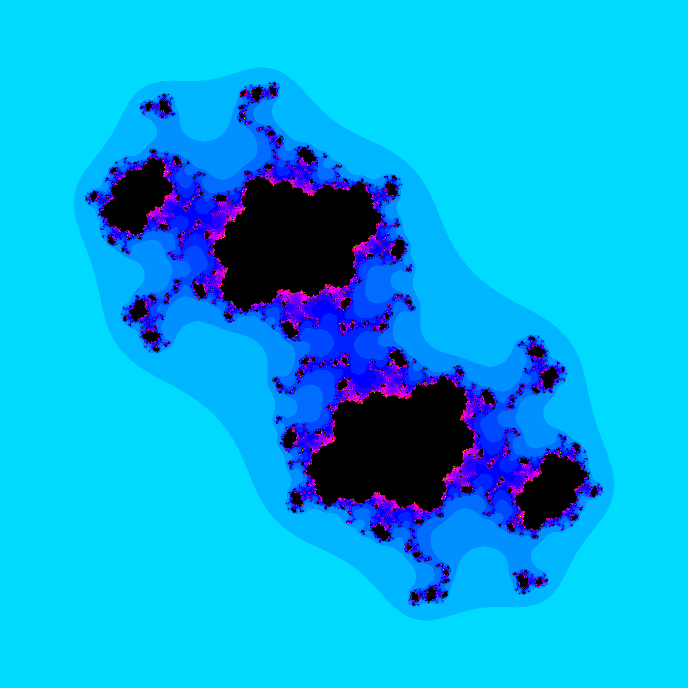

Hello, and welcome to my website! My name is Eleanor Waiss, my pronouns are [she/her/hers](https://pronouns.org/she-her), and I am an undergraduate student studying mathematics, actuarial science, and computer science at Butler University. On this website, you'll be able to learn more about me, see any previous talks I've given or papers I've written, as well as various code files I've used in those projects. 

Stay a moment, look around, and let me know if you have any questions!

Since I study [fractals](https://en.wikipedia.org/wiki/Fractal), I would be remiss if I didn't include some of the best I've run across. Read about these and more fractals like it in my [JMM 2024 talk](/talks/jmm2024). These fractals were generated using the [DynamicsExplorer](https://sourceforge.net/projects/detool/) program by Boyd.

[Who am I, outside of academia?](/about/extra)