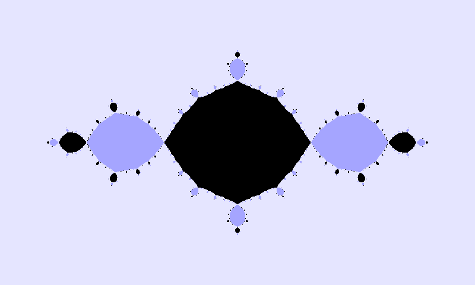

Hello, and welcome to my website! My name is Eleanor Waiss, my pronouns are [she/her/hers](https://pronouns.org/she-her), and I am an amateur mathematician studying dynamics, number theory, and computer science. On this website, you'll be able to learn more about me, see any previous talks I've given or papers I've written, the various code files I've used in those projects, and notes from classes I took as a student at Butler University. Stay a moment, look around, and let me know if you have any questions!

I strongly believe in the following axioms, from [Federico Ardila](https://fardila.com/):
1. Mathematical potential is equally present in different groups, irrespective of geographic, demographic, and economic boundaries.
2. Everyone can have joyful, meaningful, and empowering mathematical experiences.
3. Mathematics is a powerful, malleable tool that can be shaped and used differently by various communities to serve their needs.
4. Every student deserves to be treated with dignity and respect.

Since I study [fractals](https://en.wikipedia.org/wiki/Fractal), I would be remiss if I didn't include some of the best I've run across. Read about these and more fractals like it in my [JMM 2024 talk](/talks/jmm2024). These fractals were generated using the [DynamicsExplorer](https://sourceforge.net/projects/detool/) program by Boyd.

[Who am I, outside of academia?](/about/extra)