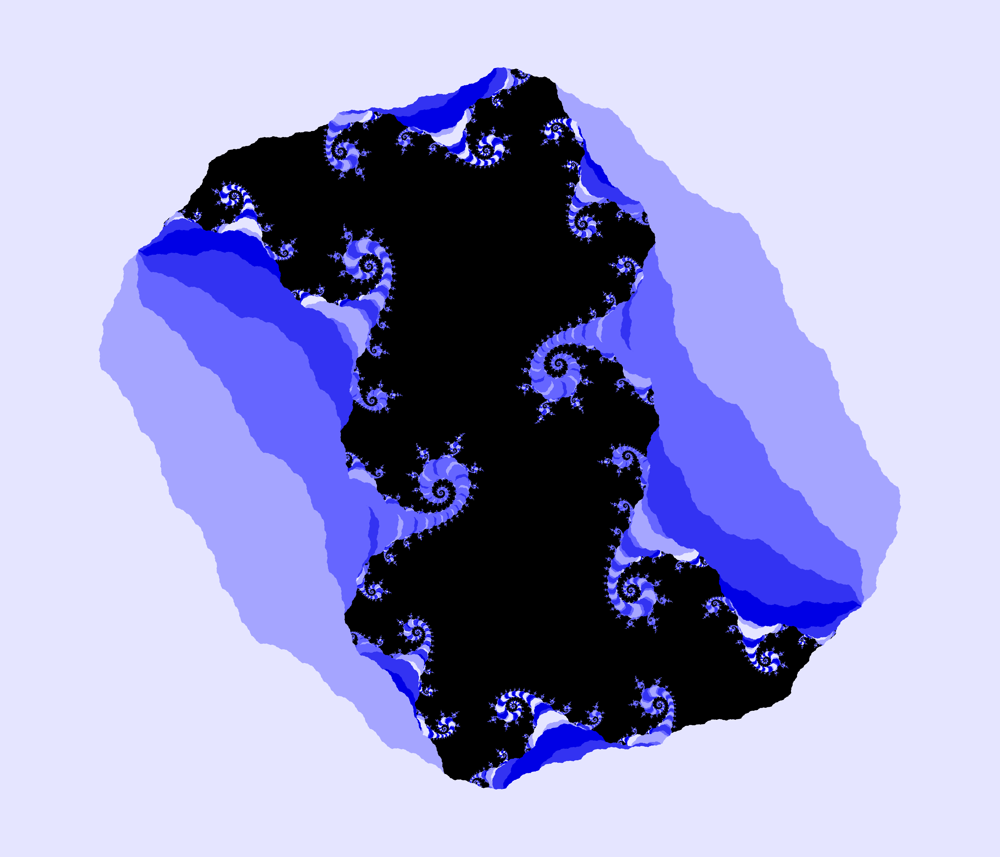

Butler University Mathematics Colloquia Series

Abstract: Complex dynamics is the study of mathematical or physical systems that evolve
over time. Due to modern technological advancements, the field of study has undergone
a renaissance and major connections with mathematical physics, biology, or interest
theory have been developed. In this talk, I will give an overview of discrete complex
dynamics and its application to fractal geometry. I will summarize major results from
Fatou, Julia, and Mandelbrot, and end with some modern results and my current work
in the field. A special effort has gone into making this talk accessible to any LAS
student comfortable with Calculus I or II .

[See the slides here](/files/colloquiumButler.pdf) (16.1 MB).
