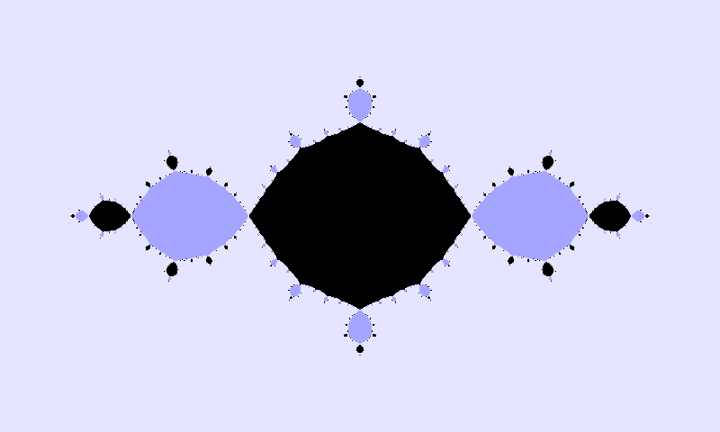

[AMS Contributed Paper Session on Dynamical Systems, Difference Equations, Integral Equations, and Differential Geometry](https://meetings.ams.org/math/jmm2024/meetingapp.cgi/Paper/29571).

Abstract: For maps of one complex variable, $f$, the geometric limit as $n$ approaches infinity of the set of points that remain bounded under iteration by $f$ has been studied in a variety of contexts. We will provide a summary of these results and some new generalizations. For maps given as the sum of two polynomials of which one is raised to this $n$, we show that the limit is almost always determined by preimages of the unit disk by the indexed polynomial. We will also discuss the limiting dynamics of maps given as the sum of a polynomial iterated n times and a fixed polynomial.

[See the slides here](/files/jmm2024-Julia.pdf) (4.50 MB).

This is joint work with my adviser, [Dr. Scott Kaschner](https://blue.butler.edu/~skaschne/), and co-author [Dr. Alex Kapiamba](https://www.math.harvard.edu/people/kapiamba-alex/).