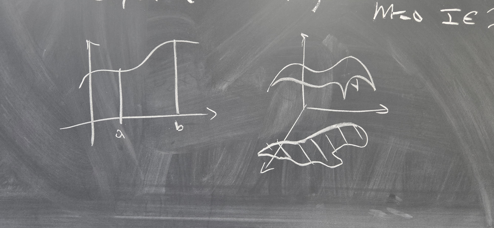

Butler Undergraduate Research Conference 2025

Abstract: The grand crescendo of Calculus I is the Fundamental Theorem of Calculus 
(FTOC): an equality between the integral of a derivative over an interval and the 
difference of the function evaluated at the interval's endpoints. This talk will 
highlight FTOC's much stronger, older brother, the generalized Stokes' Theorem, 
for integration of a differential form over a manifold. This theorem presents a 
grand unifying theory for relating functions to their derivatives and integrals. 
Along the way, we will give a cursory look at the diverse fields of differential 
topology and real analysis in several variables.

[See the slides here](/files/urc2025-Stokes.pdf) (1.67 MB).
